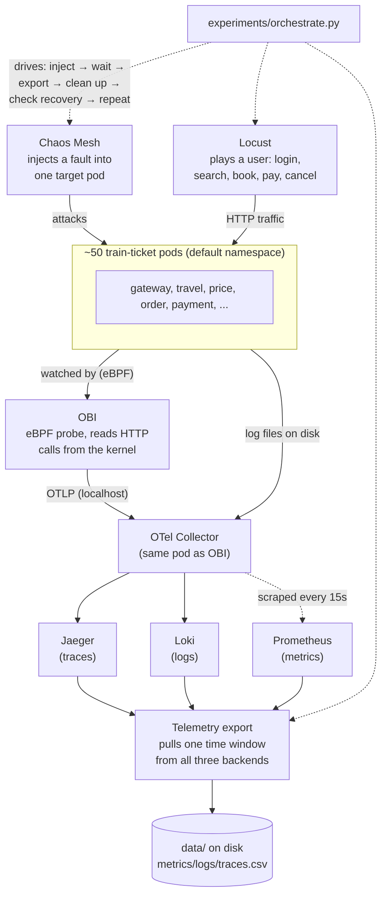

# Chaos Engineering Field Guide

A field guide to the train-ticket observability and fault-injection platform built across five phases. This document
assumes **no prior knowledge** of Train Ticket, Kubernetes, eBPF, OpenTelemetry, Prometheus, Jaeger, Loki, Chaos Mesh,
or Locust — every tool is explained in plain language before anything technical is discussed.

In one sentence: **we watch a train-ticket-booking website closely, then deliberately break one part of it at a time
(slow it down, starve it of CPU, cut its network), while pretending to be real customers booking tickets, and we save
everything the system said about itself during that window** — its logs, its request traces, and dozens of
performance metrics — so that later, someone (or some analysis tool) can look at that saved evidence and learn what a
real failure looks like from the outside.

This is useful because it's the standard way engineering teams build and test **root cause analysis (RCA)** tools —
software that looks at a pile of metrics/logs/traces and tries to automatically figure out "which service actually
broke, and why." You can't test an RCA tool without deliberately-caused failures whose real cause you already know,
and you can't do that safely without a way to break things in a controlled, repeatable, and fully-recorded way.
That's what this whole project is.

## Table of contents

1. [The big picture](#1-the-big-picture)
2. [Background, explained simply](#2-background-explained-simply)
3. [Phase 1 — Watching the system](#3-phase-1--watching-the-system)
4. [Phase 2 — Breaking things on purpose](#4-phase-2--breaking-things-on-purpose)
5. [Phase 3 — Simulating real users](#5-phase-3--simulating-real-users)
6. [Phase 4 — Saving the evidence](#6-phase-4--saving-the-evidence)
7. [Phase 5 — Running it all together](#7-phase-5--running-it-all-together)
8. [Directory reference](#8-directory-reference)
9. [Running an experiment, start to finish](#9-running-an-experiment-start-to-finish)
10. [What doesn't work (yet), and why — honestly](#10-what-doesnt-work-yet-and-why--honestly)

---

## 1. The big picture

Before any of the parts, here's the whole machine in one picture. Everything below explains one piece of it at a
time.



Chaos Mesh and Locust act on the application from the outside; OBI, the Collector, and the three storage backends
continuously record what happens; the exporter reaches back in afterward and saves a window of that recorded
history; the orchestrator ties all of it into one repeatable loop.

## 2. Background, explained simply

A short primer on every tool this project uses, in plain language, before we get into what was actually built.

### Train Ticket

Train Ticket is a free, open-source demo application built to look and behave like a real train-booking website —
like a national rail company's website, but fake, for testing purposes. It's deliberately built the "microservices"
way: instead of one big program, it's about **50 small, independent programs** (called *services*), each responsible
for one job. There's a service just for logging in (`ts-auth-service`), one just for searching train routes
(`ts-travel-service`), one just for handling payments (`ts-payment-service`), and so on. They talk to each other over
the network to fulfil a request — e.g. booking a ticket touches at least seven or eight of these services in
sequence. This makes Train Ticket a realistic stand-in for the kind of large, tangled, real-world system that's
genuinely hard to debug when something goes wrong — which is exactly why it's a popular choice for this kind of
research.

### Kubernetes and the cluster

All ~50 services (plus everything described below) run inside **Kubernetes**, the standard tool for running many
small programs on a shared pool of computers and keeping them alive, restarting them if they crash, and giving them a
stable way to find and talk to each other. In this project, Kubernetes is running on a single laptop-scale machine
via **minikube** (a tool that runs a small, single-computer Kubernetes cluster for development and testing). Every
"computer running programs" you'll read about below is really just one program (a *pod*) running inside this one
shared Kubernetes cluster.

### The three kinds of telemetry: metrics, logs, and traces

"Observability" tooling — watching a running system to understand what it's doing — almost always comes down to
collecting three different kinds of data:

- **Metrics** — numbers over time. "CPU usage was 40% at 10:00:05, 42% at 10:00:10, …" Good for seeing trends and
  spotting when something is overloaded.
- **Logs** — the text messages a program prints out while it runs ("user 42 logged in", "payment failed:
  insufficient funds"). Good for understanding exactly what happened at one specific moment.
- **Traces** — the record of one single request's journey through multiple services. If booking a ticket touches
  eight services, a trace shows exactly which of those eight services were called, in what order, how long each one
  took, and whether any of them failed. Good for understanding *where in a chain of services* something went wrong or
  got slow.

This project collects all three, for every service, continuously.

#### eBPF and OBI — watching without touching the code

Normally, to get traces out of a program, you have to add tracing code to that program yourself (or use a "language
agent" that hooks into it). With ~50 separate services, most of them written years ago, doing that by hand isn't
realistic here — and it wasn't done. Instead this project uses **eBPF**, a Linux kernel feature that lets a program
watch what the operating system's kernel is doing (like "a network message just arrived on this connection") without
modifying the programs generating that traffic at all. **OBI** (OpenTelemetry eBPF Instrumentation) is the specific
tool built on top of eBPF that this project uses: it runs once per machine, watches every HTTP/gRPC call flowing in
and out of every process on that machine at the kernel level, and reconstructs traces and performance metrics from
what it sees — with zero changes to any of the ~50 services' actual code.

#### OpenTelemetry and the "Collector"

**OpenTelemetry** (often shortened to "OTel") is an industry-standard format and set of conventions for describing
telemetry data (traces, metrics, logs) so that different tools can produce and consume it without needing to know
about each other specifically. The **OpenTelemetry Collector** is a general-purpose program that receives telemetry
in this standard format from one or more sources, optionally transforms it, and forwards it out to one or more
destinations. In this project, it's the "hub" that sits between OBI (the source) and the three storage systems below
(the destinations).

#### Prometheus, Jaeger, and Loki — the three storage systems

Each kind of telemetry has its own specialized storage/query system, all free and open-source, all widely used in the
real world:

- **Prometheus** stores metrics. It's installed here via a pre-packaged bundle called **kube-prometheus-stack**,
  which also includes **Grafana** (a dashboard/graphing tool), **Alertmanager**, and automatic collectors for
  standard Kubernetes/Linux metrics (CPU, memory, disk, network — via a tool called **node-exporter** and a
  built-in Kubernetes component called **cAdvisor**).
- **Jaeger** stores and lets you query traces. You give it a service name and a time range, and it gives you back
  the traces — including, critically, how spans in different services connect to each other into one call chain.
- **Loki** stores and lets you query logs, the way Prometheus does for metrics — you can search by labels (which
  pod, which container) and time range, similar to grep but indexed and fast, at scale.

### Chaos Mesh — breaking things on purpose

**Chaos engineering** is the practice of deliberately injecting failure into a system — slowing down its network,
starving it of CPU, corrupting its disk I/O — in a controlled way, to learn how it behaves under real-world failure
conditions before those failures happen for real. **Chaos Mesh** is a Kubernetes-native tool for doing exactly that:
you create a small YAML file describing a fault (e.g. "delay all network traffic to pods labeled
`app: ts-travel-service` by 200ms, for 60 seconds") and Chaos Mesh's own components carry it out at the
kernel/network level, then automatically reverse it when you delete that YAML file.

### Locust — simulating real users

None of the telemetry above is very interesting if nothing is actually using the website while a fault is happening —
a database that's slow to respond only shows up as a problem if something is actually querying it. **Locust** is a
load-testing tool: you write a Python script describing what a "user" does (log in, search for a train, book a
ticket, pay, cancel), and Locust runs many copies of that script simultaneously, simulating real traffic against the
website, so there's always something happening for the observability stack to observe and for the chaos experiments
to disrupt.

---

## 3. Phase 1 — Watching the system

**Goal:** get continuous metrics, logs, and traces flowing out of all ~50 train-ticket services, with zero code
changes to any of them.

### What got built, and where it lives

| Path | What it is |
|---|---|
| `deployment/observability/otel-obi/` | The OBI + OTel Collector DaemonSet and its configuration (four YAML files: RBAC, the collector's own config, the DaemonSet itself, and a Prometheus scrape hook). |
| `deployment/observability/jaeger/`, `loki/`, `prometheus/` | Helm "values" files — configuration overrides for each of the three storage backends, installed via their official Helm charts. |
| `hack/observability/` | Small shell scripts (`install-*.sh`, `uninstall-*.sh`) that run the Helm installs for each piece. |
| `verify/` | An automated health-check suite — see below. |

### Why OBI and the Collector share one pod

A single Kubernetes object called a **DaemonSet** was created, which — unlike a normal Deployment — automatically
runs exactly one copy of its pod on every machine in the cluster (here, that's just one machine, so one pod). That
one pod runs **two containers side by side**:

- **`obi`** — does the actual eBPF watching, running in "privileged" mode (needed to install eBPF probes into the
  kernel) with access to the host's process list.
- **`otelcol`** (the OpenTelemetry Collector) — receives OBI's output over a private connection on `localhost`,
  *also* independently reads every pod's log files directly off the machine's disk, and then forwards traces to
  Jaeger, logs to Loki, and exposes metrics for Prometheus to pick up.

Putting them in the same pod means OBI can hand data to the Collector over a fast, private local connection instead
of over the network, and it means one `kubectl apply` stands up the whole pipeline.

> **How the log-tailing actually works.** Kubernetes writes every container's console output to a predictable file
> path on the machine's disk (under `/var/log/pods/…`). The Collector container mounts that host directory directly
> into itself (plus `/var/lib/docker/containers`, since on this cluster the container runtime is Docker and that's
> where the actual raw log files live) and tails every file it finds — no agent needs to run inside each of the ~50
> service pods.

### Getting it working: four real problems, in order

None of this worked on the first try. Each fix below was diagnosed against the live cluster, not guessed:

**Problem 1 — the Collector wouldn't start.** The plan was to send logs to Loki using a Collector component
literally called the `loki` exporter. It turned out that component had been removed from the version of the
Collector being used here. The Collector now sends logs to Loki using the more general-purpose `otlphttp` exporter
pointed at Loki's own OTLP-format endpoint instead.

**Problem 2 — OBI wouldn't start.** An environment variable controlling which kinds of metrics OBI produces was set
to an invalid value. Fixed by using one of the three values OBI actually accepts.

**Problem 3 — OBI ran, but produced no traces at all.** OBI has two modes: a lightweight "network metrics only"
mode, and a full "application observability" mode that actually reconstructs HTTP traces. It defaults to the
lightweight mode unless you explicitly tell it which processes to trace. Adding one setting
(`OTEL_EBPF_AUTO_TARGET_EXE=*`, "trace every process") turned application-level tracing on.

**Problem 4 — OBI kept crashing (out of memory).** The moment OBI switched into full tracing mode, it tried to
instrument *every process on the entire machine* — not just the train-ticket services, but Docker itself,
Kubernetes' own internals, the monitoring tools, everything. That's far more than the container's original 512MB
memory limit could hold, so it kept getting killed and restarted. First fix: raise the memory limit. Real fix, done
later once the rest of the pipeline was working: restrict OBI to *only* watch the Kubernetes namespace the actual
train-ticket app lives in (`deployment/observability/otel-obi/obi-config.yaml`), which is both correct (we only care
about the application, not the whole machine) and dramatically lighter.

### Proving it actually works: the trace-propagation smoke test

Getting all the pieces to start without crashing doesn't prove the pipeline is actually *correct*. The real test:
send one request into the website (a ticket search, through the gateway service), then check Jaeger for the
resulting trace. The key thing to check isn't just "did a trace appear" — it's whether the individual spans from
*different services* are correctly linked together into one connected chain (proving that the standard cross-service
tracing context, called `traceparent`, is propagating correctly across the network calls), rather than each service
just producing its own disconnected, unlinked span. This was confirmed directly: one request produced a single trace
ID with the gateway service's span correctly listed as the *parent* of the travel service's span underneath it.

### Automated verification: the `verify/` suite

Rather than re-checking all of this by hand every time, an automated test suite was built at the repository root
(deliberately placed outside `deployment/`, since it's a tool for checking the deployment, not part of the
deployment itself):

| File | What it checks |
|---|---|
| `common.sh` | Shared helpers used by every other script: pass/fail reporting, and safe management of temporary `kubectl port-forward` connections (the technique used throughout this project to reach services inside the cluster from the outside). |
| `check-infra.sh` | Are Prometheus, Jaeger, and Loki actually installed and are all their pods healthy? |
| `check-otel-obi.sh` | Is the OBI/Collector DaemonSet running, with no crashes, and is Prometheus actually able to reach it and pull its metrics? |
| `check-smoke-test.sh` | The trace-propagation test described above, run for real, end to end, every time. |
| `run-all.sh` | Runs everything above and prints one pass/fail summary. Also runnable as `make verify-observability`. |

---

## 4. Phase 2 — Breaking things on purpose

**Goal:** a repeatable, scriptable way to inject one specific kind of fault into one specific service, and cleanly
remove it again afterward.

### What got built, and where it lives

| Path | What it is |
|---|---|
| `deployment/fault-inject-deployment/chaos-mesh/*.yaml` | Six fault "templates" — one YAML file per kind of fault Chaos Mesh can perform. |
| `deployment/fault-inject-deployment/chaos-mesh/inject.py` | The single Python entry point everything else in this project uses to start and stop a fault. |
| `hack/chaos-mesh/` | Install/uninstall scripts for Chaos Mesh itself (via Helm). |
| `verify/check-chaos-mesh.sh` | Health checks, plus a real, live inject-then-verify-then-clean-up test. |

### The six fault types

Each YAML template targets pods by their `app: <service-name>` label — the same label every Train Ticket service
already uses to identify itself — so any of the ~50 services can be targeted just by name, with no per-service setup
needed:

| Fault type | What it does |
|---|---|
| `stress-cpu` | Pins the target's CPU usage high, simulating an overloaded service. |
| `stress-mem` | Consumes a large chunk of the target's memory. |
| `stress-socket` | Opens huge numbers of network connections against the target, simulating connection/file-descriptor exhaustion. |
| `io-disk` | Adds artificial latency to the target's disk reads/writes. |
| `network-delay` | Adds artificial latency to the target's network traffic. |
| `network-loss` | Randomly drops a percentage of the target's network packets. |

### How `inject.py` works

Each YAML template is a static file with placeholder values (a fake pod name, a default 60-second duration). At call
time, `inject.py`:

1. loads the right template for the requested fault type,
2. fills in the real target service name, a freshly-generated unique experiment name, the requested duration, and
   any fault-specific parameters (e.g. how many milliseconds of network delay),
3. sends the finished YAML to Kubernetes (via `kubectl apply`),
4. and returns that unique experiment name as the one piece of information the caller needs to remember — later,
   `cleanup(experiment_name)` uses it to delete exactly that fault.

This is deliberately different from an older, unused script already sitting in this repository
(`gray-release-manage.py`), which was written for a completely different, unfinished approach (gradually shifting
live traffic between two versions of one service using a tool called Istio, which was never actually installed on
this cluster — see the limitations section). `inject.py` keeps that older script's basic technique (build a YAML
file in Python, then hand it to `kubectl`) but is a proper, reusable, error-checked tool rather than a one-off script
with a single hardcoded target.

> **A real capacity problem this surfaced.** Once OBI was tracing every process on the machine (see Phase 1, Problem
> 4), Jaeger's own trace storage started crashing with out-of-memory errors — it was being flooded with huge volumes
> of uninteresting background noise (constant internal "is everything still alive" chatter between services), on top
> of its original, modest memory allowance. Fixed two ways together: Jaeger's memory limit was quadrupled, and — more
> importantly — OBI was narrowed to only trace the application's own namespace (the same fix mentioned in Phase 1),
> which cut the noise at the source instead of just tolerating more of it.

---

## 5. Phase 3 — Simulating real users

**Goal:** continuous, realistic traffic hitting the website, so there's always something happening for the
observability stack to record and for chaos faults to actually disrupt.

### What got built, and where it lives

| Path | What it is |
|---|---|
| `deployment/load-generator/locustfile.py` | The Locust script itself — what one simulated user does. |
| `deployment/load-generator/deployment.yaml` | Runs Locust continuously (no fixed end time) — meant to be started before an experiment and left running through it. |
| `deployment/load-generator/job.yaml` | Runs Locust for one fixed burst (e.g. 5 minutes) and then stops on its own. |
| `hack/load-generator/` | Deploy/undeploy/run scripts, wired to `make load-generator` etc. |

### What the simulated user actually does

The script logs in with a pre-existing test account, searches for a train between two stations, books a ticket on
one of the results, pays for it, and then cancels it — the same journey a real customer would take, end to end. Most
simulated users only search without booking (weighted 3-to-1), since that's closer to how real traffic actually
looks — most visits to a booking site don't end in a purchase.

### Three real bugs found while building this

Every single request/response shape used by this script was checked against the live, running website first — not
assumed from reading the underlying Java source code. That process caught three real, pre-existing bugs in Train
Ticket itself:

**Bug 1 — a silently wrong field name.** The train-search request needs a field called `startPlace`. An earlier,
reasonable-looking guess, `startingPlace`, is silently accepted by the server (it just ignores fields it doesn't
recognize) and returns an empty result with a normal-looking success response — no error at all. Easy to mistake for
"there's no data for this route" when really it's "the request was silently ignored."

**Bug 2 — inconsistent seed data.** Train Ticket ships with a small set of pre-loaded example train routes. Several
of them turned out to reference a route that doesn't actually include the destination station the trip claims to run
to — a genuine data-entry mistake in the sample data. Result: searching between some "obviously fine" station pairs
correctly, legitimately returns zero results. Fixed not by changing that data, but by finding and using two station
pairs that do have consistent data.

**Bug 3 — a crash in the order-lookup service.** After booking a ticket, the confirmation response doesn't actually
include the new booking's ID (a separate, smaller bug) — so the next step has to look it up. That lookup service
crashes with an internal error unless you also supply values for a few unrelated, optional date-range filters, even
when you don't want to filter by them at all. Worked around by supplying harmless, wide-open date ranges alongside
the filter that's actually wanted.

> **A known, accepted limitation.** All simulated users log in as the *same* shared pre-loaded test account (real
> accounts you create yourself start with no money loaded, so they can't actually pay for anything). Because of
> that, under heavy concurrent load, two simulated users can occasionally both try to act on "the most recent
> booking," and get it wrong. This was verified directly: at 15 simultaneous users starting at once, 2 out of 312
> requests failed this way — a small, honestly-reported failure rate, not a silent one. Acceptable for a load
> generator whose job is producing realistic *traffic shape*, not for anything that needs financial correctness.

---

## 6. Phase 4 — Saving the evidence

**Goal:** given a start time and an end time, pull everything Prometheus/Jaeger/Loki recorded during that window and
save it to plain files on disk — so a chaos experiment's evidence survives independently of how long those backends
themselves keep data for.

### What got built, and where it lives

| Path | What it is |
|---|---|
| `deployment/telemetry-export/metrics_map.py` | No code — just a lookup table mapping a metric's name to the actual database query needed to fetch it. |
| `deployment/telemetry-export/metrics_export.py` | Runs every query in that table against Prometheus and writes `metrics.csv`. |
| `deployment/telemetry-export/logs_export.py` | Pulls every log line for the window from Loki and writes `logs.jsonl`. |
| `deployment/telemetry-export/traces_export.py` | Pulls every trace for every service from Jaeger and writes `traces.csv`. |
| `deployment/telemetry-export/run_writer.py` | Runs all three of the above together and writes a summary file describing what happened. |
| `deployment/telemetry-export/http_retry.py` | A small shared helper: automatically retries a failed network call a few times before giving up (added once real, in-the-wild flakiness was observed — see Phase 5). |
| `hack/telemetry-export/export.sh` | A wrapper that opens the network connections needed to reach Prometheus/Jaeger/Loki from outside the cluster, then runs the export. |

### One important design decision: this code doesn't "record" anything

Prometheus, Jaeger, and Loki are already continuously recording everything, all the time — that's the whole point of
Phase 1. Phase 4 doesn't tap into a live feed; it just asks those three systems, after the fact, "what did you see
between time A and time B?" and copies the answer to local files. This matters because it means the export step can
be re-run, is simple to reason about, and never risks missing data due to a timing race — the data was already
safely recorded before the export step ever runs.

### What each file actually contains

- **`metrics.csv`** — one row per (timestamp, metric, value); which pod or machine it belongs to; which of four
  standard performance categories it falls into (latency, errors, traffic, or saturation — a well-known framework
  for organizing performance signals).
- **`logs.jsonl`** — one JSON object per log line: which pod, which container, the detected severity level, and the
  raw message text. Saved as one-JSON-object-per-line rather than a spreadsheet-style table, because log messages are
  free-form text that can contain almost anything (commas, quotes, multi-line content) that would make a simple table
  format unreliable.
- **`traces.csv`** — one row per individual span (a "span" is one single service's part of a larger trace): which
  trace it belongs to, which span is its parent (this is what lets you reconstruct the whole call chain later), which
  service, how long it took, and — where available — the HTTP method, route, and status code.
- **`run_info.json`** — a manifest: the exact time window, how many of each kind of record were found, and —
  importantly — an explicit list of anything that came back *empty*, so a missing signal is always a visible,
  recorded fact rather than something that silently disappears.

### Choosing what to measure: `metrics_map.py`

A specific list of ~50 named performance signals was requested up front (things like "95th-percentile latency," "CPU
usage," "packets dropped," grouped into the four standard categories mentioned above). Two real problems turned up
while wiring this list up to the actual running cluster, and both were resolved by directly inspecting what
Prometheus actually had available — never by guessing:

**Problem — some requested signals were named after a tool that isn't installed.** Several signal names in the
original list (e.g. anything starting with `istio-`) referred to metrics produced by **Istio**, a service-mesh tool.
This cluster doesn't have Istio installed (see the limitations section for why). The very first version of this
lookup table worked around that by pointing those names at OBI's equivalent HTTP signal instead, but kept the
misleading `istio-` name on the saved output. That was corrected: every saved metric is now named after the *real*
underlying signal actually being measured (e.g. `http_server_request_duration_seconds:p50`, OBI's own real metric
name, with a `:p50` suffix meaning "the 50th percentile of this histogram") — never a name borrowed from a
different, absent tool.

**Problem — some requested signals were genuinely missing.** Several container-level metrics (CPU time split into
"user" vs "system," memory swap usage, the configured CPU/memory limits) simply weren't showing up in Prometheus at
all. Investigated directly on the live cluster (by querying Kubernetes' own metrics endpoint directly, bypassing
Prometheus) — and it turned out the data genuinely exists and is being correctly generated with the right labels;
Prometheus's own default configuration was just explicitly configured to throw it away as "not useful," before it
even got stored. That default configuration was overridden
(`deployment/observability/prometheus/values.yaml`) to stop discarding those six specific metrics, and all six were
confirmed flowing into Prometheus with real data afterward.

> **One signal that's genuinely not fixable this way.** Per-pod network traffic metrics (bytes/packets sent and
> received) turned out to be a different, deeper problem: on this specific machine's setup, the underlying data
> source only ever reports network activity for the machine as a whole, never broken down by individual pod.
> There's no real per-pod data for Prometheus to keep — so no configuration change can produce it. The table still
> records what the query *would* be on a cluster where this data does exist, so the table stays useful elsewhere,
> but reports these specific signals as honestly empty here.

---

## 7. Phase 5 — Running it all together

**Goal:** one command that loops over a list of (service, fault type) combinations, and for each one, safely runs
the entire cycle — check health, start traffic, break something, wait, save the evidence, fix it, confirm recovery —
before moving to the next.

### What got built

One file: `experiments/orchestrate.py`. It doesn't introduce any new capability — it calls the exact same building
blocks from Phases 2 through 4 (Chaos Mesh's `inject()`/`cleanup()`, the Locust deploy script, the telemetry export's
`run()` function) directly, as a Python library, rather than re-implementing any of their logic.

### What happens for each (service, fault type) run

1. **Confirm the cluster is healthy** — every pod cluster-wide should be running normally. If not, the whole run
   stops rather than starting a new experiment on top of an already-broken cluster.
2. **Make sure Locust is running** — if it isn't (e.g. it's the very first run), deploy it.
3. **Record the exact moment, then inject the fault** — via Chaos Mesh's `inject()`.
4. **Wait** — for the fault's configured duration, plus a "settle" period afterward, so the recorded evidence
   captures the system's recovery, not just the failure itself.
5. **Export the telemetry for that window** — including a short "baseline" period *before* the fault started, so
   there's a clear "before" to compare the "during/after" against.
6. **Clean up the fault** — this step always runs, even if something above it failed, so a fault can never
   accidentally get left running.
7. **Wait for full recovery** — confirm the cluster is healthy again before starting the next run in the loop.

Every individual run's outcome, plus a summary of the whole batch, is written to a JSON file at the end — whether the
batch completed in full or had to stop partway through.

> **A real, reproducible-ish problem found while testing this.** During testing, exporting logs from Loki
> occasionally timed out completely — for as long as three minutes — immediately after a CPU-stress fault, even
> though Loki itself was healthy and responded instantly seconds later. The explanation: this whole cluster runs on
> a *single* machine, so a fault that pins one service's CPU usage high is, physically, competing for the exact same
> CPU cores that Prometheus, Jaeger, and Loki themselves are also running on. Squeezing the system being watched
> inevitably also squeezes the thing doing the watching. Fixed by adding automatic retries with increasing wait
> times (`deployment/telemetry-export/http_retry.py`) to every network call the exporters make, so a brief slowdown
> doesn't abort an entire multi-run batch — while a call that's still failing after several honest attempts still
> stops the batch loudly instead of silently producing incomplete data.

> **Not yet run at full scale.** The orchestrator has been verified end to end with a single, minimal run (one
> service, one fault type, one repeat) — confirmed to correctly inject, wait, export a complete set of
> metrics/logs/traces, clean up, and detect recovery. It has deliberately not yet been run across the full set of
> services and fault types; that requires deciding how many services, which fault types, and how many repeats per
> combination first.

---

## 8. Directory reference

Every folder this project added, at a glance.

| Folder | Contains |
|---|---|
| `deployment/observability/otel-obi/` | OBI + OTel Collector DaemonSet (Phase 1) |
| `deployment/observability/{jaeger,loki,prometheus}/` | Helm configuration for the three storage backends (Phase 1) |
| `deployment/fault-inject-deployment/chaos-mesh/` | Fault templates + `inject.py` (Phase 2) |
| `deployment/load-generator/` | Locust script + Kubernetes Job/Deployment (Phase 3) |
| `deployment/telemetry-export/` | The four export scripts + shared retry helper (Phase 4) |
| `experiments/` | The orchestrator (Phase 5) |
| `hack/observability/`, `hack/chaos-mesh/`, `hack/load-generator/`, `hack/telemetry-export/` | Small install/deploy/run shell scripts, one folder per phase, each wired to a `make` target |
| `verify/` | The automated health-check + smoke-test suite (spans Phases 1 and 2) |
| `data/` | Where exported experiment evidence lands (git-ignored — this is output, not source) |

---

## 9. Running an experiment, start to finish

Assuming the cluster already exists (minikube up, Train Ticket already deployed), this is the full sequence to
install everything and run one experiment by hand.

```bash
# 1. Install the observability stack (Phase 1)
make prometheus
make jaeger
make loki
make otel-obi

# 2. Check it's all actually working
make verify-observability

# 3. Install Chaos Mesh (Phase 2)
make chaos-mesh

# 4. Start realistic traffic (Phase 3)
make load-generator

# 5. Inject one fault by hand, and remember its name
python3 deployment/fault-inject-deployment/chaos-mesh/inject.py \
  inject ts-travel-service network-delay --duration 60s --param latency=200ms

# 6. ...wait, then clean it up
python3 deployment/fault-inject-deployment/chaos-mesh/inject.py \
  cleanup network-delay-ts-travel-service-XXXXXXXX

# 7. Save the evidence for that time window (Phase 4)
hack/telemetry-export/export.sh --service ts-travel-service --fault-type network-delay \
  --start-time <unix seconds> --end-time <unix seconds> --output-dir data

# --- or, skip steps 5-7 and run steps 3-7 together, in a loop, automatically: ---
python3 experiments/orchestrate.py \
  --service ts-travel-service --fault-type network-delay \
  --repeats 3 --duration 60 --settle 30 --baseline 30 --output-dir data
```

Every result lands under `data/<service>_<fault_type>/<run_id>/`, as `metrics.csv`, `logs.jsonl`, `traces.csv`, and a
`run_info.json` summary.

---

## 10. What doesn't work (yet), and why — honestly

Nothing below is hidden or silently worked around; each is a known, deliberate, documented gap.

**No Istio.** Istio is a "service mesh" — infrastructure that sits between every service and every other service,
handling things like traffic routing, encryption, and automatic retries, and producing detailed traffic metrics as a
side effect. It's not installed here. This project's telemetry needs (metrics, logs, traces) are already fully
covered by OBI's eBPF-based approach, without needing to add an extra network proxy in front of every one of the ~50
services. Istio would only be worth adding if the project specifically needed its traffic-shaping features (like
gradually shifting live traffic between two versions of a service) — which is what an older, unused, unfinished
script already in this repository (`gray-release-manage.py`) was originally built for, before this project's
fault-injection needs were instead met by Chaos Mesh.

**No per-pod network traffic metrics.** Explained in Phase 4 — the underlying data source on this specific machine
setup only reports network activity at the whole-machine level, never broken down by individual pod, so there's no
real per-pod data available to collect, on this cluster, regardless of configuration.

**The load generator shares one test account.** Explained in Phase 3 — a small, known, and honestly-measured rate of
"wrong booking" errors can occur under heavy concurrent simulated-user load, because everyone shares one login. Fine
for producing realistic traffic shape; not suitable for anything requiring financial correctness.

**Some requested performance metrics have no equivalent.** A handful of originally-requested signal names didn't
correspond to anything this cluster's tools actually produce, and unlike the Istio substitutions, weren't given a
stand-in at all — they were simply left out, on the grounds that inventing a plausible-sounding fake name for a
signal with no real underlying data would be worse than not having it.

**The full experiment sweep hasn't been run yet.** The orchestrator (Phase 5) is built and verified to work
correctly for a single run. Running it across the full set of services and fault types — the actual point of
building it — is a deliberately separate step, waiting on a decision about scope (how many services, which fault
types, how many repeats) before committing to what could be a long-running, resource-intensive batch job.

---

*Written as a field guide to the state of this repository at the end of this project's fifth phase. Every claim
above was checked against the live, running cluster while it was being written, not assumed from source code alone.*
